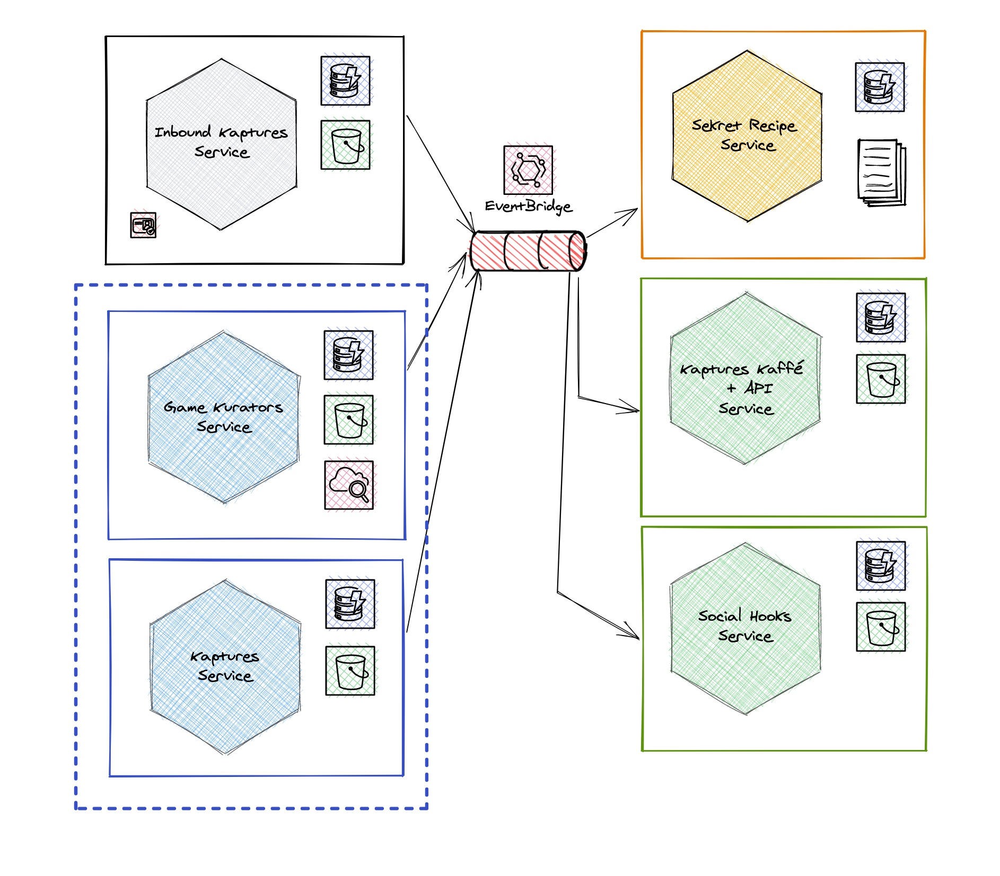

# Kaptures

Kaptures is a fictional startup. Its value prop is socialize gaming, making it more 
engaging for our users and their friends in social media. Kapture *launched* in 2020,
mid-pandemic, a weird time when everyone is in their homes playing.

Kaptures is available wherever you're playing: PC (GOG and Steam), XBox, Switch and Amazon Luna. 
We integrate with each platform, and distribute your content to all your social media.

We started with screenshots (kaptures), and added achievements, rankings and we are currently
working on adding video (from 20s shorts, to full game play videos).

## How it works?
We have plugins for all the platforms mentioned above. After you activate the Kap, it starts
taking lots kaptures of your gameplay, along with the input on your keyboard/controller and
microphone (where supported), and uploads all this information into your Kap account (Don't
worry, your data is encrypted in flight and at rest), later you can select what you can share
and who you share it with.

Our IA (dubbed Sekret Recipe) selects the best shots based on all your info, and the historical
data we have for that game from other players, and makes suggestions so you share the Crème de la crème, 
and Wow your friends and community.

## Context Diagram

