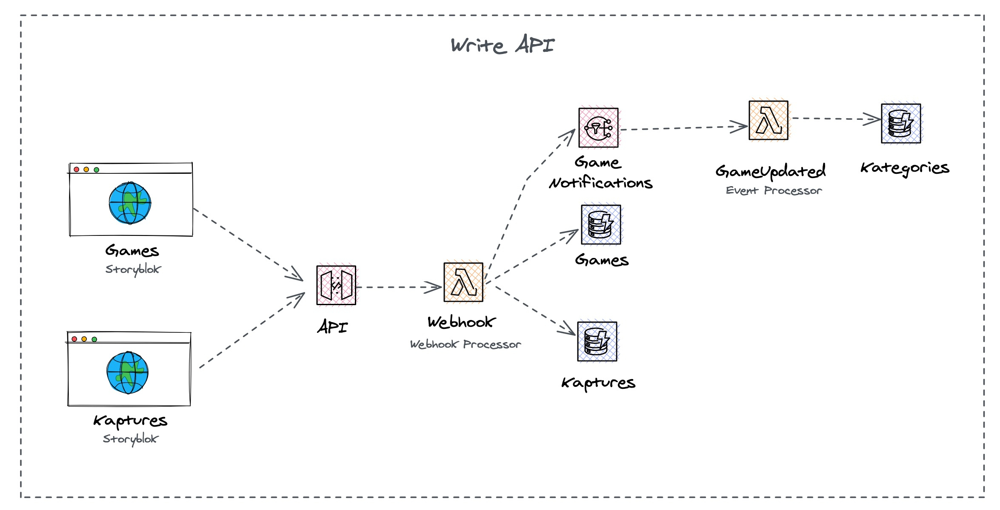
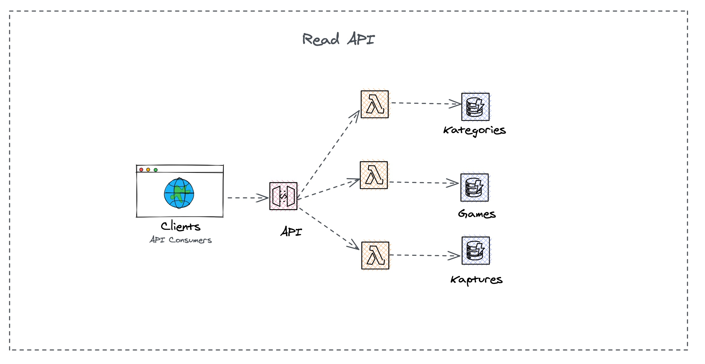

# Kurator Service

Kurator Service is part of KAPs Content Stack. Our team of Kap Kurators add games 
to our platform with all their details like where the game is available, categories, 
web page, game developer, etc.

They also write about games, achievements, and select the best Kaptures for the game's 
detail page on Kapture's Kaffe (our main website).

## How it works?

Just a centralized database that owns the definitions of the games. Kurators use our CMS
to add content there, a webhook publishes these updates on our system, and makes them 
available to our other systems via our centralized event bus.

## Components Diagrams
### Write API


### Read API


## Running the code

This project uses the [Architect Framework](https://arc.codes/) for it's Read and Write APIs.
Architect makes it easy and painless to build, develop and deploy Serverless Applications on AWS. 

### Installing Architect
`npm i -g @architect/architect aws-sdk`

### Get a free tier AWS Account where to deploy the project

Follow this to set up a [free tier AWS Account](https://aws.amazon.com/getting-started/hands-on/run-serverless-code/).
We will need it to deploy the code. If you already have one, just set up your AWS profile.

### Set up the Content Schema

Storyblok is a headless CMS. We use Storyblok to mock our Applications (CMS and Kapture apps/plugins), it's
a quick way to create prototypes when starting a new project. Get a free Storyblok account 
[here](https://app.storyblok.com/#!/signup). When prompted, say that you are a Dev and create a new Workspace.

Install the [storyblock CLI](https://www.storyblok.com/docs/Guides/command-line-interface), and import the schema into your workspace:

```
npm i -g storyblok
storyblok login
cd storyblok
```