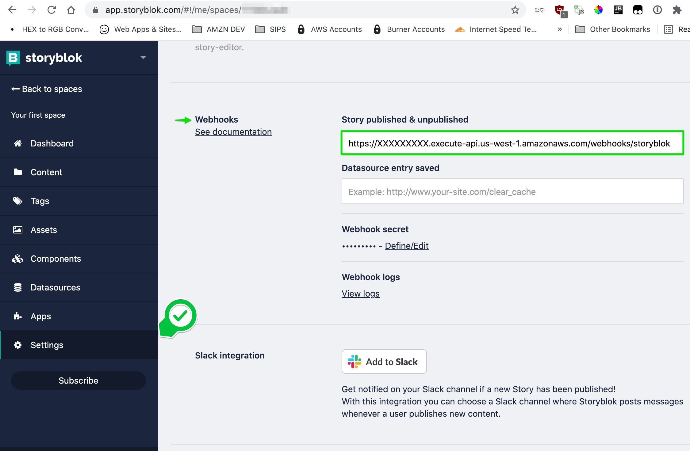

# Kurator Service

Kurator Service is part of KAPs Content Stack. Our team of Kap Kurators add games 
to our platform with all their details like where the game is available, categories, 
web page, game developer, etc.

They also write about games, achievements, and select the best Kaptures for the game's 
detail page on Kapture's Kaffe (our main website).

##### Table of Contents
- [Components Diagrams](#components-diagrams)
  - [Write API](#write-api) 
  - [Read API](#read-api)
- [Running the code](#running-the-code)
- [Local Development](#developer-workflow)
- [Using Postman](#using-postman)

## How it works?

Just a centralized database that owns the definitions of the games. Kurators use our CMS
to add content there, a webhook publishes these updates on our system, and makes them 
available to our other systems via our centralized event bus.

## Components Diagrams
### Write API


### Read API


## Running the code

This project uses the [Architect Framework](https://arc.codes/) for it's Read and Write APIs.
Architect makes it easy and painless to build, develop and deploy Serverless Applications on AWS. 

### Install Architect
```shell
~/Workspace/kaptures/kurator-service(main*) »npm i -g @architect/architect aws-sdk
```

### Get a free tier AWS Account where to deploy the project

Follow this to set up a [free tier AWS Account](https://aws.amazon.com/getting-started/hands-on/run-serverless-code/).
We will need it to deploy the code. If you already have one, just set up your AWS profile.

### Set up the Content Schema

Storyblok is a headless CMS. We use Storyblok to mock our Applications (CMS and Kapture apps/plugins), it's
a quick way to create prototypes when starting a new project. Get a free Storyblok account 
[here](https://app.storyblok.com/#!/signup). When prompted, say that you are a Dev and create a new Workspace.

Install the [storyblock CLI](https://www.storyblok.com/docs/Guides/command-line-interface), and import the schema into your workspace:

```shell
~/Workspace/kaptures/kurator-service(main*) » npm i -g storyblok
~/Workspace/kaptures/kurator-service(main*) » storyblok login
~/Workspace/kaptures/kurator-service(main*) » cd storyblok
```

Get your space id:

```shell
~/Workspace/kaptures/kurator-service(main*) » storyblok spaces
✓ Loading spaces...

Your first space (id: 114786)
----------------------------------
```

Push the schema:
```shell
~/Workspace/kaptures/kurator-service(main*) » storyblok push-components https://raw.githubusercontent.com/eduardoromero/kaptures/main/kurator-service/storyblok/components.json --space 114786


Hi, welcome to the Storyblok CLI

- Executing push-components task
- Get presets from component games
- Creating component games...
- Pushing 0 new presets
✓ 0 presets sync
✓ Component games has been updated in Storyblok!
- Get presets from component kaptures
- Creating component kaptures...
- Pushing 0 new presets
✓ 0 presets sync
✓ Component kaptures has been updated in Storyblok!
```

**Games** and **Kaptures** should be available as new types on your [spaces](https://app.storyblok.com/#!/me/spaces).

### Deploying

After you set up your AWS Credentials, make sure you have `AWS_PROFILE` and `AWS_REGION`

```shell
~/Workspace/kaptures/kurator-service(main*) » arc deploy                                                                                                                                                                gomdua@3c22fb64b625
         App ⌁ kurator-service
      Region ⌁ us-west-1
     Profile ⌁ foxteck
     Version ⌁ Architect 8.5.10
         cwd ⌁ /Users/gomdua/Workspace/kaptures/kurator-service

⚬ Deploy Initializing deployment
  | Stack ... KuratorServiceStaging
  | Bucket .. kurator-service-cfn-deployments-92a4e
⚬ Hydrate Hydrating dependencies in 7 paths
✓ Hydrate Hydrated src/events/game-updates/
  | npm ci --production: added 137 packages, and audited 138 packages in 1s
  | npm ci --production: found 0 vulnerabilities
✓ Hydrate Hydrated src/http/get-api-categories-000category/
  | npm i --production: added 140 packages, and audited 141 packages in 4s
  | npm i --production: 11 packages are looking for funding
  | npm i --production: run `npm fund` for details
  | npm i --production: found 0 vulnerabilities
✓ Hydrate Hydrated src/http/get-api-categories/
  | npm ci --production: added 135 packages, and audited 136 packages in 1s
  | npm ci --production: found 0 vulnerabilities
✓ Hydrate Hydrated src/http/get-api-games-000game/
  | npm i --production: added 140 packages, and audited 141 packages in 4s
  | npm i --production: 11 packages are looking for funding
  | npm i --production: run `npm fund` for details
  | npm i --production: found 0 vulnerabilities
✓ Hydrate Hydrated src/http/get-api-games/
  | npm ci --production: added 135 packages, and audited 136 packages in 1s
  | npm ci --production: found 0 vulnerabilities
✓ Hydrate Hydrated src/http/get-index/
  | npm ci --production: added 117 packages, and audited 118 packages in 1s
  | npm ci --production: found 0 vulnerabilities
✓ Hydrate Hydrated src/http/post-webhooks-storyblok-games/
  | npm i --production: added 121 packages, and audited 122 packages in 4s
  | npm i --production: 8 packages are looking for funding
  | npm i --production: run `npm fund` for details
  | npm i --production: found 0 vulnerabilities
⚬ Hydrate Hydrating app with shared files
✓ Hydrate Hydrated app with shared: src/shared
✓ Hydrate Hydrated app with views: src/views
✓ Hydrate Successfully hydrated dependencies
⚬ Deploy Created deployment templates
⚬ Deploy These Lambdas should ideally be under 5MB for optimal performance:
  | src/events/game-updates (10,392KB)
  | src/http/get-api-categories (10,454KB)
  | src/http/get-api-categories-000category (11,366KB)
  | src/http/get-api-games (10,453KB)
  | src/http/get-api-games-000game (11,366KB)
  | src/http/get-index (9,235KB)
  | src/http/post-webhooks-storyblok-games (10,105KB)
✓ Deploy Generated CloudFormation deployment
✓ Deploy Deployed & built infrastructure
✓ Success! Deployed app in 102.144 seconds

    https://XXXXXXXXX.execute-api.us-west-1.amazonaws.com

```

### Set up the Webhook

Go to your [spaces](https://app.storyblok.com/#!/me/spaces) on Storyblok, select your the same space you used for the 
schema update step above, and click on **Settings**, then on **Webhooks** enter the URL from your deployment,
and hit the *Save Button* on the top right of your space:



### Get an API KEY

Also in **Settings**, on the tabs at the top go to **API-KEYS** and create a new token.


### Update the Deployment with your new API KEY

Set up the new keys with `arc env` and redeploy.

```shell
~/Workspace/kaptures/kurator-service(main*) » arc env staging STORYBLOCK_API_TOKEN EZD1U1ARnDr0EAVaEaHCQAA
         App ⌁ kurator-service
      Region ⌁ us-west-1
     Profile ⌁ foxteck
     Version ⌁ Architect 8.5.10
         cwd ⌁ /Users/gomdua/Workspace/kaptures/kurator-service

✓ Env Added STORYBLOCK_API_TOKEN to staging environment
✓ Env Total environment variables found: 2
⚬ Env Staging env vars:
  | STORYBLOCK_API_TOKEN EZD1U1ARnDr0EAVaEaHCQAA
✓ Env Updated prefs.arc file with latest environment variables
--------------------------------------------------------------------------------------------------------------------------------------------------------------------------------------------------------------------------------------------
```
```shell
~/Workspace/kaptures/kurator-service(main*) » arc env testing STORYBLOCK_API_TOKEN EZD1U1ARnDr0EAVaEaHCQAA
         App ⌁ kurator-service
      Region ⌁ us-west-1
     Profile ⌁ foxteck
     Version ⌁ Architect 8.5.10
         cwd ⌁ /Users/gomdua/Workspace/kaptures/kurator-service

✓ Env Added STORYBLOCK_API_TOKEN to testing environment
✓ Env Total environment variables found: 3
⚬ Env Testing env vars:
  | STORYBLOCK_API_TOKEN EZD1U1ARnDr0EAVaEaHCQAA
✓ Env Updated prefs.arc file with latest environment variables

```

```shell
~/Workspace/kaptures/kurator-service(main*) » arc deploy
...

✓ Success! Deployed app in 96.647 seconds
```

### Add new Content

Publish a new Game entry:


### Webhook logs
Verify the webhook is working, go to: `https://app.storyblok.com/#!/me/spaces/[SPACE_ID]/webhook_logs`

## Developer Workflow

### Run locally on Sandbox
The [Sandbox](https://staging.arc.codes/docs/en/guides/developer-experience/local-development) is a local development environment that runs on http://localhost:3333/
It will recreate your tables and lambdas in memory, and refresh automatically when you make changes.

```shell
$ arc sandbox
```

### Deploy
After your changes work locally, re-deploy to update your Serverless App.

```shell
$ arc deploy
```

### Using Postman

Get [Postman](https://www.postman.com/downloads/), then load the collection [here](./postman/kaptures.postman_collection.json):


### Prettier logs
Run `npm i -g pino-pretty`. Then when starting the local sandbox use:

```shell
$ arc sandbox|pino-pretty
```

